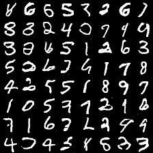

# tf_GAN_mnist
One of the most basic GAN setup. Training on MNIST dataset for generating handwritten digits.

# Training
`python train.py`

# Generating
`python generate.py`

Result:

# Convert to video
`python convert_to_video.py`
